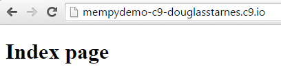

#Deploying a Flask app to Heroku
At the MEMpy meeting in March, we saw how to create and deploy a simple Flask application to Heroku using the Cloud9 IDE.  What follows is a detailed description of how to recreate a similiar application.

####What you'll need
Before you begin you'll need to sign up for a few online services:
* Github - If you haven't created a Cloud9 account yet, you can easily do so with Github
* Cloud9 - Use your Github account to log in
* Heroku - This is the cloud hosting service
* MongoLab - This is the database

######Github
The home page for Github is [github.com](http://github.com).  We won't be using Github for in this tutorial for anything other than creating a Cloud9 account.  If you already have a Github account, skip to the next section.  Otherwise, go to the Github home page and create a new account.  You'll have to verify your email address by clicking on a link in an email they will send to you.  After that, you're ready to move on to Cloud9.

######Cloud9 IDE
This is the browser-based development environment we will be using.  It's completely free to use except there is one note of caution I like to reiterate.  **In the free Cloud9 workspaces, all code is public read-only.**  This means that you should not store sensitive data like OAuth tokens or API keys in the code (and you shouldn't do this anyway).  We'll see a better way of doing this when we get to MongoLab.

The Cloud9 home page is [c9.io](http://c9.io).  You can use your Github account (see the previous section) to create a Cloud9 account.  Just click on the icon that looks like the silhouette of a cat next to the 'SIGN IN' button:


If you already have a Cloud9 account associated with Github you'll be taken to the dashboard.  Otherwise, a screen will ask you to authorize Cloud9 to use your Github account.  Once you agree, you'll be taken to the dashboard.

######Heroku
Heroku is a cloud web application hosting provider.  We will use Heroku to serve our application.  Heroku is free just like Github and Cloud9 (or at least it has a free plan which will be more than enough for our simple application.) but you can't use Github to log in.  So you'll need to go to the Heroku homepage at [heroku.com](http://heroku.com) and create an account.  The process is similar to Github and you'll need to verify your email by clicking on a link they will send you in an email.  

One note about Heroku, it also has paid plans.  By default, you get 5 applications and a limited number of add on services (such as databases) for free.  However, if you verify your account with a credit card, they will give you 100 application and more add ons.  This will make the next step, adding MongoDB support, very easy.  However, I understand that not everyone will want to do this so I have included the instructions for using MongoLab with Heroku without a verified account.

######MongoLab
MongoLab is the host for the database that we will use.  This database is called MongoDB.  If you haven't worked with MongoDB or it's relatives (collectively referred to as NoSQL) it's quite different from other databases you might have used in the past.  However, it's super simple to use, is pre-installed on Cloud9 for testing purposes, has an excellent Python library and is free!  So just like Heroku, you can't use Github to login.  You'll need to go to the MongoLab home page at [mongolab.com](http://mongolab.com) and create an account.  After that, head back to Cloud 9 and we'll start coding!

####Setting up Cloud9
There is not a lot to do here because most everything is preinstalled but there are a few things we need to do.  First we have to create a new workspace.  When you log in to Cloud9, you'll be taken to the dashboard which has a list of your workspaces on the left.  By default, Cloud9 creates a demo project workspace for you, but we are going to create one from scratch.  So click the green 'CREATE NEW WORKSPACE' button in the upper left and then on the 'Create a New Workspace' link in the pop up menu:


You'll be presented with the 'Create a New Workspace' dialog:


1. Give your workspace a name.  This name does not have to be unique across Cloud9, only to your account so you can use _mempydemo_ like shown above.
2. Select _Open and Discoverable_ for _Workspace Privacy_.  This is the option to get free workspaces.
3. For _Hosting_ select _Hosted_.  Again, this is for the free workspaces.
4. Select _Custom_ for the workspace type.  This will give us a blank workspace without any opinions as to the framework or language we will be using.
5. Click the green _CREATE_ button.

A new entry in the left of the window will come up with your workspace name and a gear.  This mean Cloud9 is creating the workspace.  It should only take a few seconds.  Cloud9 is very fast!


When Cloud9 is finished you can click the green _START EDITING_ button in the right side of the window.


Below is a picture of the default layout for the Cloud9 IDE:


1. The project manager that shows a tree view of the files in this workspace.
2. An editor similar to Sublime Text with optional vim binding.
3. A Linux terminal with sudo shell access.

There are only a few more things we need to do to get set up and all of them can be done from the terminal.

First, since all new Python development is going to be done in Python 3, we should use it.  However, the default version of Python installed on Cloud9 workspaces (which are running on top of Ubuntu 14.04) is 2.7.6 (feel free to verify this by running `python --version`.  So we are going to create a _virtual environment_ which is a special instance of Python that thinks it is the default version.  Virtual environments can have their own Python version and implementation as well as their own set of libraries installed.  Fortunately, Cloud9 includes the virtual environment scripts for us.  So to create a virtual environment with Python 3, run the following command in the terminal:
```
mkvirtualenv --python=`which python3` mempydemo
```
You'll see some output similar to this:
```
Running virtualenv with interpreter /usr/bin/python3
Using base prefix '/usr'
New python executable in mempydemo/bin/python3
Also creating executable in mempydemo/bin/python
Installing setuptools, pip...done.
```
The last parameter is the name of the virtual environment.  You can use any name you want but since this is specific only to this workspace, you can use _mempydemo_ to make it easier to follow along.  Notice that the prompt in the terminal is now prefixed with the name of the virtual environment in parentheses.  This means you are inside a virtual environment.  To verify this run the command `python --version` again and you should see a variant of Python 3, 3.4.0 as of this writing.

To leave a virtual environment, run the command `deactivate`.  The prefix willbe removed from the prompt and Python 2.7.6 will be the default version again.  Again, check this with `python --version`.  To enter the virtual environment, run `workon mempydemo` (or whatever you named your virtual environment) and you'll see the environment is now active again.

If you look at the output from `mkvirtualenv` the last line says it installed an application called `pip`.  This is a package manager that will retrieve and install Python packages and their dependencies from the internet.  We are going to use it to install Flask, the web framework we will use to write our application.  Run this command in the terminal:

```
pip install Flask
```

This will create a lot of output and you don't need to worry about it as long as there are no errors.  However, notice that at the end of the output it installed Flask as well as four other packages.  These are packages that Flask depends on.  Also, just before that, pip compiled a native C extension that one of the packages uses.  Cloud9 is set up for you to do this.  Otherwise, you would have had to install some prerequisite development libraries.  Cloud9 helps you out more than you think!

We'll install some more packages later but this will get us started.  Let's go ahead an write a simple application.

####Our first application
We need to create a new Python file to hold our code.  This can be done in many ways.  You can create a new file through the IDE by selecting _File -> New File_ from the menu, by right clicking on a folder in the project manager and by click the plus (+) tab in the editor:


My preferred way is to create create new files in the terminal.  To do this make sure you are in the _workspace_ directory in your home directory (`cd ~/workspace` to move there) and then run `touch main.py` where _main.py_ is the name of the file to create.  Then double click on that file in the project manager.  If you don't see it you may have to refresh the file tree which you can do by clicking on the gear in the project manager and selecting _Refresh File Tree_.


The following code will comprise our application:

```python
from flask import Flask
import os

app = Flask(__name__)
app.debug = True

@app.route('/')
def index():
    return 'Hello MEMpy'

if __name__ == '__main__':
    port = int(os.getenv('PORT', 8080))
    host = os.getenv('IP', '0.0.0.0')
    app.run(port=port, host=host)
```

We'll go more in depth with Flask later but for a quick look at the code.  The first two lines import packages, namely Flask and os which we use in the entry point to get values for environment variables.  The next two lines create an instance of Flask and turn on debugging so that if (when) errors happen we will see a nice stack trace in the browser.  (Of course this should __NEVER__ be enabled in a production application.)  The `route()` decorator tells Flask that when it receives a request for the root of the site to invoke the `index()` function.  That function merely returns a string which Flask will wrap in an HTTP response and send back to the browser.  The entry point extracts values for environment variables named _PORT_ and _IP_.  This is because if the application is started on a certain port and ip address that Cloud9 has reserved, the application will be accessible to the public web via a special URL.  These are stored in the environment variables.  The last line starts Flask on the port and ip we retrieved before.

To start this app, just run `python main.py` in the terminal.  You should see the following output:
```
 * Running on http://0.0.0.0:8080/ (Press CTRL+C to quit)
 * Restarting with stat
```
The first line tells us the server did indeed start.  And the second line is because it is running in debug mode.

Now let's access our application from a browser.  The URL we can go to for our applcation is the form:

`[workspace]-c9-[username].c9.io`

For example, my workspace name is _mempydemo_ and my username is _douglasstarnes_ so the URL for my application would be

`http://mempydemo-c9-douglasstarnes.c9.io`

Going to the URL for the application should yield the message 'Hello MEMpy'.


To stop the server press _Ctrl-C_ in the terminal.

Also, after you close the browser, the workspace will become idle and the process running the server will be terminated.  Obviously, this is not intended for long term hosting.  For a robust hosting solution, we'll turn to Heroku.


####Deploying to Heroku
Before we can deploy our application to Heroku there is of course some set up involved.  Fortunately, this only has to be done once for the application.  The first step is to log in to Heroku via the tools in the Heroku Toolbelt.  Normally, we would need to install this manually but Cloud9 to the rescue, they have pre-installed it in the workspace for us.  So run the following command in the terminal:
```
heroku login
```
You'll be asked to provide the email address and user name that you used to sign up with.  After that, you'll be able to use the commands to create and manage deployments.

Before that, we need to prepare our application for deployment.  And we'll create some files to give Heroku information as to how to install and configure our application.  The first one is called `runtime.txt` and merely contains the version of Python that the application requires.  To refresh, run `python --version` in the terminal.  The output I got when writing this is:
```
Python 3.4.0
```
So create a new file in the same directory as `main.py` and call it `runtime.txt`.  The contents is a single line.  In my case for Python 3.4.0 it is:
```
python-3.4.0
```
The next file is called `Procfile` and it tells Heroku the command to run to start the server.  In our case it is simply: `python main.py`.  The contents of `Procfile` should be:
`web: python main.py`
The last file tells Heroku the dependencies that the application requires.  These were installed for us automatically when we installed Flask with pip.  And we can retrieve what was installed with the command `pip freeze`.  The output you get should be similar to this: (your version numbers may differ)
```
Flask==0.10.1
Jinja2==2.7.3
MarkupSafe==0.23
Werkzeug==0.10.4
itsdangerous==0.24
```
The file Heroku looks for to determine what dependencies to install is called `requirements.txt` and we could just copy the output of `pip freeze` into a new file but there is an easier way.  Linux will let you _redirect_ the output of a command to a file.  So for our needs the command
```
pip freeze > requirements.txt
```
will suffice.

######Git
Git is a version control system.  As you work on your project you would _commit_ changes at various stages to a Git _repository_ and Git would keep track of those changes and also allow mulitple people to work on the same project without silently overwriting each other's work.  However, we are going to use Git for deploying our application to Heroku's servers.  When you are ready to send commited changes to a server, you do a _push_ to the server.  When you push changes to Heroku's server, it will also trigger the deployment process of copying files, installing dependencies and starting the application.  So let's set up Git.

Again, Cloud9 has made this easy by installing it on the workspace for you.  So the first thing we need to do in make sure the current directory is the root of the workspace (`~/workspace`) and initialize it as a Git repository with the command:
```
git init .
```
Where the last parameter is the directory to use or '.' (dot) for the current directory.

Then we need to tell Git which files to add to this repository.  We can just add all of them with the command:
```
git add .
```
Finally, we need to commit the changes to the local git repo with the command:
```
git commit -m 'initial commit'
```
Now the paramter to the -m (for _message_) flag allows you to provide some text to describe the changes in this commit.  You should get in the habit of doing this.  Commits are not large changes always so you shouldn't need much text.  However, we can use some dummy text like above for now.

######Push to Heroku
The commands `git add` and `git commit` have come to be known as part of the 'check in dance'.  The last step is to push the committed changes to the remote server, Heroku is this case.  First, we have to be able to tell Git where that server is.  Heroku makes this very easy for you.  When you create a new app on Heroku, it will create a Git _remote_ that will specify Git repository that Heroku has set up for your application.  To create a new app use the `apps:create` command:
```
heroku apps:create [app-name]
```
You can omit the app-name and heroku will generate one for you or you can provide one.  However, it must be unique across Heroku so you might have to try more than once to find one that is not in use.

The `apps:create` command will set up the remote which you can see with the command `git remote -v` (v for verbose).  And we can see that it created a remote called _heroku_.  That will obviously be the source.  We also need to provide a destination for git on Heroku which will be called _master_.  Heroku also set that up for us.  So the command to push the application to Heroku ends up being:
```
git push heroku master
```
This will take a little while and product a lot of output.  You'll see that it will detect the Python version in `runtime.txt` and then installed the dependencies from `requirements.txt`.  Then it launch the application and verify the deployment.  After that, assuming everything worked, it will return to the command line without error.  

To see our application on the web, we have a URL reserved for us in the form:
`[app-name].herokuapp.com`
I called my app _mymempydemo_ so the URL to my app is `http://mymempydemo.herokuapp.com/`.


If that seemed like a lot of steps, it was but most them only have to be done once for the application.  In the future, when we make changes we'll only need to add any new files and then commit the changes and push them.  So the check-in dance ends up being:
```
git add .
git commit -m 'message'
git push heroku master
```
And you don't have to push after every commit.  The push will push all of the commits since the last push

The rest of this tutorial will focus on the application itself.  We'll add Bootstrap to make it look nice, create templates and forms, and hook it up to MongoDB.

####Connecting to MongoDB

######MongoLab
In the beginning of this tutorial, you created an account with a service called MongoLab.  Now we will set up a MongoDB database in MongoLab.  Log into your MongoLab account at [mongolab.com](http://mongolab.com).  The section _MongoDB Deployments_ will be empty.  Click on the _Create new_ button.

On the next page, under _Create new subscription_ select the following options:


1. For the _Cloud provider_ select any of the providers available.  I selected Amazon Web Services.
2. Under _Plan_ be sure to select _Single-node_.  This is the only option with a free quota.
3. Select the _Sandbox_ plan, which is free.

Give your database a name and click the _Create_ button.

You'll then see the deployments page again, with the newly created database.


Now we need to create a new user for the database to access it remotely.  Click on the new database.  You'll see the following page.  There will be a message that you should create a new user.  Click the link that is highlighted to create a new user.


A short dialog will appear asking for a username and password for the new user.

Back in the database page, you'll see a URI of the form:
```
mongodb://<dbuser>:<dbpassword>@<host>:<port>/<db>
```
We will use this URI to connect to MongoDB from Python via a package called MongoEngine.  But first, we need to have a way for Python to know about the URI.  We could store it in a Python constants file but then that would make it visible to the world as we are using the free workspaces on Cloud9 and all of the files are public read-only.  However, we can use an environment variable to store the URI.  We can set up a new environment variable on Heroku using the web interface at [heroku.com](http://heroku.com).

Log in to Heroku and you'll be taken to the dashboard where you'll see the app you created from before.  


Click on it and then on _Settings_ tab.

In Settings you'll see a section _Config Variables_.  Click on the link to show the config variables and then on the _Edit_ button on the right.  Create a new variable with the _KEY_ set to `MONGOLAB_URI` and the _VALUE_ set to the URI from MongoLab.  You'll need to substitute the username and password with those you created for the new database.  Then click the _Save_ button.

That's got MongoDB set up on MongoLab and Heroku.  But this is our production database that is live on the web.  We want to be able to have a test database that we can experiement with.  Fortunately, Cloud9 has thought of this for us and has preinstalled MongoDB on our instance.  Let's get that set up next.

######MongoDB on Cloud9
The best way to set up MongoDB on Cloud9 is to refer to this page in the Cloud9 documentation: [https://docs.c9.io/v1.0/docs/setting-up-mongodb](https://docs.c9.io/v1.0/docs/setting-up-mongodb)

In the root of your workspace (`~/workspace`), create a new directory called 'data' with the following command in the terminal:
```
mkdir data
```

Then run the following command to make a script that will start MongoDB:
```
echo 'mongod --bind_ip=$IP --dbpath=data --nojournal --rest "$@"' > mongod
```

Finally make the script executable:
```
chmod a+x mongod
```

Now run the script to start MongoDB:
```
./mongod
```

You'll have to open a new terminal tab to continue because the server will consume the current one.  To do this, click on the (+) tab at then end of the tab bar for the terminal and select _New Terminal_:


Also, the new terminal will not have the virtual environment activated so you'll need to use the `workon` command to activate the virtual environment you created before.

######MongoEngine
Now we need to install mongoengine, the Python package that will connect to MongoDB.  We will use pip to do this again:
```
pip install mongoengine
```

We also need to update the `requirements.txt` file so that when we push to Heroku, mongoengine will be installed on the server:
```
pip freeze > requirements.txt
```

Now we can test MongoEngine.  I'll do this in a new file that I'll call `test_mongo.py`.  This isn't standard practice but it will be OK for experimentation.

In my test file I will first connect to the database.  Mongoengine provides a function `connect()` that we can import from the `mongoengine` package.  So at the top of the file:
```
from mongoengine import connect
```

Then in the entry point call the `connect()` function and pass it the name of the database to use.  This will connect to the test instance of MongoDB we just set up.  Before we push to Heroku, we will set it up to connect to MongoLab.  We can use any database name for testing and MongoDB will create it for us:

```python
if __name__ == '__main__':
    connect('mempydemo')
```

Now we need to tell MongoDB what data we want to store. We will keep it very simple and store shapes with two properties: a name (which will be a string), and a number of sides (an integer).  We will do this in a Python class.  However, MongoEngine gives us a class that tells MongoEngine how to load, save and do other things with data.  This class is called `Document`.  We'd like to use that so our class will inherit from `Document`:

```python
class Shape(Document):
    name = StringField()
    sides = IntField()
```

`Document`, `StringField`, and `IntField` are also in the `mongoengine` package so we need to import them as well:

```
from mongoengine import connect, Document, StringField, IntField
```

Back in the entry point, we'll create a couple of `Shape` objects.  Then we'll call the `save()` method inherited from `Document` to persist the changes to MongoDB:
```python
square = Shape('square', 4)
octagon = Shape('octagon', 8)
circle = Shape('circle', 1)
point = Shape('point', 0)

square.save()
octagon.save()
circle.save()
point.save()
```

Here is the entire code for the test file:
```python
from mongoengine import connect, Document, StringField, IntField

class Shape(Document):
    name = StringField()
    sides = IntField()
    
if __name__ == '__main__':
    connect('mempydemo')
    
    square = Shape('square', 4)
    octagon = Shape('octagon', 8)
    circle = Shape('circle', 1)
    point = Shape('point', 0)

    square.save()
    octagon.save()
    circle.save()
    point.save()
```

> You might notice the red 'x's in the gutter in the Cloud9 editor.  This is Cloud9 telling you that it can't find the method `save()` on the `Shape` objects.
>
> 
> 
> However, this is not an error in this case.  The x's can be ignored.  The dynamic nature of Python makes static analysis difficult.  

To run this test file, execute the command:
```
python test_mongo.py
```

If if looked like nothing happened, that is probably a good thing.  To see the data in the database we need to connect to it with the `mongo` command line app.  So in the terminal run the command:
```
mongo
```


You'll see some output similar to this: (ignore any warnings about the REST interface)
```
MongoDB shell version: 2.6.7
connecting to: test
Server has startup warnings: 
2015-03-28T23:25:19.828+0000 ** WARNING: --rest is specified without --httpinterface,
2015-03-28T23:25:19.828+0000 **          enabling http interface
```

To see if out database was create run the `show dbs` command in the `mongo` shell.  The output will look something like this:
```
admin      (empty)
local      0.078GB
mempydemo  0.078GB
```

And we can see that the database was created.  Switch to it with the `use mempydemo` command.  MongoDB store data as _documents_ inside of _collections_.  The `Shape` class we created represents a document.  So if we run the `show collections` command in the `mongo` shell we should see it:
```
shape
system.indexes
```

To see the documents (data) that are inside of a collection, we can call the `find()` method on the collection.  In the `mongo` shell, the variable `db` refers to current database.  The collections are just properties on that `db`.  So to get all of the documents in the `shape` collection we would run:
```
db.shape.find()
```

And see something like this:
```
{ "_id" : ObjectId("55173eecbe0cfc0a02a6b18e"), "name" : "square", "sides" : 4 }
{ "_id" : ObjectId("55173eedbe0cfc0a02a6b18f"), "name" : "octagon", "sides" : 8 }
{ "_id" : ObjectId("55173eedbe0cfc0a02a6b190"), "name" : "circle", "sides" : 1 }
{ "_id" : ObjectId("55173eedbe0cfc0a02a6b191"), "name" : "point", "sides" : 0 }
```

Your values for '_id' will definitely vary, but other than that it should be the same.

Now that we have a database server working, we can build out the rest of the app.  If you want to clean up the database and start fresh run:
```
db.dropDatabase()
```
This will delete the database but it will be recreated the next time we connect to it and save a document.  Exit the `mongo` shell with _Ctrl D_.  Then delete the test file.

####Flask and forms
We're going to create the present day 'Hello world' app which is a todo list.  So first we'll create a form that will let a user create a new todo item.  We'll use an HTML template for this and have Flask display that template on the index page.  Templates in Flask are by default stored in a directory in the root of the application called `templates` so let's go ahead and create one:
```
mkdir templates
```

Next, inside of the `templates` folder, create a new template called `index.html` and add the following markup to it:
```html
<html>
    <body>
        <h1>Index page</h1>
    </body>
</html>
```

Back in `main.py` import the `render_template` function from the `flask` package.
```
from flask import Flask, render_template
```
This function will take the path of a template relative to the `templates` directory.  It will also optionally take a collection of keyword arguments to populate the template.  Then it will return a string representing the final HTML document.  For starter let's just render the document.  Change the body of the `index()` function:
```python
def index()
    return render_template('index.html')
```

Now we can run the application and look at it in the browser.  You should see something like this:


Let's put the form in the `index.html` template:
```html
<h3>Create a new task</h3>
<form action="" method="post">
    Task: <input type="text" name="task"><br/>
    Days until due: <input type="text" name="duedays"><br/>
    Priority: <input type="text" name="priority"><br/>
    <input type="submit" value="Create Task">
</form>
```
The result should be something like the following:


We'll make it look better after we get the application working.

If you try to create a new task now, you'll get an error:


This is because we specified the POST method in the form.  By default, request handler functions (such as `index()`) can only handle GET requests.  The `route` decorator accepts a list of methods that the handler function can handle:
```python
@app.route('/', methods['GET', 'POST'])
def index():
    return render_template('index.html')
```

Make this change, save `main.py` and the server will restart.  Now you can press the button and get no errors.  But nothing appears to have happened.  That's because we are not watching for a POST request in the handler function.

To detect POST requests, we'll need to import a member from `flask` called `request`:
```
from flask import Flask, render_template, request
```

This member will always represent the current HTTP request.  It has a `method` property that will hold the method of the current request such as 'GET' or 'POST'.  If the method is a GET request, we'll return the template.  If it is a POST request, we'll use the `form` property of `request` to access the form values.  This `form` property is a dictionary like object that we can use to access the form values by name.  So the `index()` function now looks like this:
```python
@app.route('/', methods=['GET', 'POST'])
def index():
    if request.method == 'GET':
        return render_template('index.html')
    elif request.method == 'POST':
        return 'task: {0}, days til due: {1}, priority: {2}'.format(
            request.form['task'],
            request.form['duedays'],
            request.form['priority'])
```
Save `main.py` and the server will restart.  Then the form should work as in the following screengrabs:


---


######Storing the Todo items
Now we have all the pieces that we need to store todo items in MongoDB. So let's implement that next.  

First we need a class deriving from `Document` that will represent a todo item.  The class will have:
* task - string (`StringField`)
* duedays - integer (`IntField`)
* priority - integer (`IntField`)
* complete - boolean (`BooleanField`)

Here is the code for our TodoItem class:
```python
class TodoItem(Document):
    task = StringField()
    duedays = IntField()
    priority = IntField()
    complete = BooleanField()
```

> Don't forget to import `Document`, `StringField`, `IntField` and `BooleanField` from the `mongoengine` package.

At the top of the file, right after creating the Flask app, add a call to `connect()`:
```python
connect('mempydemo')
```

> Don't forget to import `connect` from the `mongoengine` package.

Next, inside of the `index()` function where we handle the POST request, replace the body with the following code:
```python
task = request.form['task']
duedays = int(request.form(['duedays'])
priority = int(request.form['priority'])
complete = False

todo = TodoItem(task=task, duedays=duedays, priority=priority, complete=complete)
todo.save()

return redirect('/')
```

First, the `redirect()` function will tell the browser to go to the URL passed to it.  You'll need to import `redirect` from the `flask` package.  Also, we always set `complete` to `False`.  It doesn't make much sense to create todo item that is already complete.

For reference, here is the entire `main.py` file since we have made so many changes:
```python
# main.py (this is a comment)
from flask import Flask, render_template, request, redirect
import os
from mongoengine import connect, Document, StringField, IntField, BooleanField

app = Flask(__name__)
app.debug = True

connect('mempydemo')

class TodoItem(Document):
    task = StringField()
    duedays = IntField()
    priority = IntField()
    complete = BooleanField()
    
@app.route('/', methods=['GET', 'POST'])
def index():
    if request.method == 'GET':
        return render_template('index.html')
    elif request.method == 'POST':
        task = request.form['task']
        duedays = int(request.form['duedays'])
        priority = int(request.form['priority'])
        complete = False
        
        todo = TodoItem(task=task, duedays=duedays, priority=priority, complete=complete)
        todo.save()
        
        return redirect('/')
    
if __name__ == '__main__':
    port = int(os.getenv('PORT', 8080))
    host = os.getenv('IP', '0.0.0.0')
    app.run(port=port, host=host)
```
Save the file to restart the server and try to enter a new task.  It will appear that nothing happened.  So let's run the `mongo` shell and see if we have a TodoItem document in the database:
```
MongoDB shell version: 2.6.7
connecting to: test
Server has startup warnings: 
2015-03-28T23:25:19.828+0000 ** WARNING: --rest is specified without --httpinterface,
2015-03-28T23:25:19.828+0000 **          enabling http interface
> show dbs
admin      (empty)
local      0.078GB
mempydemo  0.078GB
> use mempydemo
switched to db mempydemo
> show collections
system.indexes
todo_item
> db.todo_item.find()
{ "_id" : ObjectId("55175599be0cfc0f89dd46dc"), "task" : "My new task", "duedays" : 7, "priority" : 10, "complete" : false }
```


Sure enough it worked!  Now we need to display a list of the todo items.  The index page is a good place to do that, just before the form to create a new todo item.


#### Displaying a list of TodoItems
Getting the `TodoItem` documents out of the database could not be easier.  The `Document` class has an `objects` property which will get all documents of that type from MongoDB.  So the line:
```python
TodoItem.objects
```

Will get all of the `TodoItem` documents as `TodoItem` inherits from `Document`.  Now we need to send those documents to the template.  So modify the call to `render_template`:
```python 
return render_template('index.html', todos=TodoItem.objects)
```

Now we will use a templating language that is part of the Jinja2 package inside of `index.html` to iterate through `todos` and print the task for each one.  Jinja2 is installed as part of Flask. (`pip freeze` to verify it is installed).  Before the form in `index.html` add this code:
```html
<h3>All Todos</h3>
<ul>

    <li>{{ item.task }}</li>

</ul>
```
As you can see, this reads very much like Python.  The `` syntax escapes the templating language.  The value inside the double curly braces is rendered as text.  Save all files, the server will restart and if you go to the root of the site ('/') you should see the task you just created:


This is looking good, but there is still more to be done.  It would be nice to be able to mark items as complete, highlight overdue items, sort items by priority and more.  This would be best served with buttons and styling.  Bootstrap makes short of that so we'll tackle it next.  But first, let's push what we have to Heroku.

####Push to Heroku again
We have some prep work to do before we can push to Heroku.  First, there are some files that we don't want to push.  That would be the `data` directory and the `mongod` script.  We can tell Git to ignore these files by placing their paths in a `.gitignore` file.  So create a `.gitignore` file with the following:
```
mongod
data/
.c9/
```
The `.c9` directory is created by Cloud9 so we don't need to send it to Heroku.

Next we need to tell Flask which database to connect to if it is running on Heroku.  Remember that we created an environment variable on Heroku through the web interface called `MONGOLAB_URI` that points to a database on MongoLab's servers.  To check if it exists run this command in the terminal:
```
heroku config
```

And the output will be something like this: (obviously your urls will vary)
```
=== mymempydemo Config Vars
MONGOLAB_URI: mongodb://heroku_app35297401:<your_password_here>@ds059888.mongolab.com:59888/heroku_app35297401
```

This environment variable does not exist on Cloud9 so if we can access it, we can assume we are running on Heroku.  Therefore a simple `if` clause can be added to the top of `main.py` in place of the `connect()` call:
```python
if os.getenv('MONGOLAB_URI') is not None: # on Heroku
    mongolab_uri = os.getenv('MONGOLAB_URI')
    db = mongolab_uri[mongolab_uri.rfind('/')+1:] #extract the database name
    connect(db, host=mongolab_uri)
else: # on Cloud9
    connect('mempydemo')
```

Now we can proceed with the check in dance and push to Heroku:
```
git add .
git commit -m 'push to heroku with mongodb'
git push heroku master
```

You can now go to `[app-name].herokapp.com` and see the application working on Heroku. 


Also, you can go to [mongolab.com](http://mongolab.com) and browse the database:


> If you are having trouble with your MongoLab URI, you can try to connect via the `mongo` shell in the Cloud9 terminal with the command:
>
> `mongo <host>:<port>/<db> -u <dbuser> -p <dbpassword>`
>
> You get all of the variables from the URI which is:
>
> `mongodb://<dbuser>:<dbpassword>@<host>:<port>/<db>`

The next part will show how to make things look nice with Bootstrap and then we'll look at updating data so we can mark items as complete.  Check back soon!


